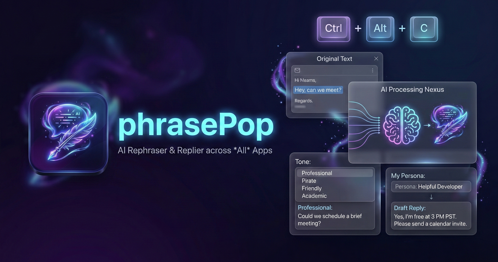

<div align="center">
  
  <h1>PhrasePoP</h1>
  <p><strong>A blazing fast, OS-wide AI text assistant spanning every application you use.</strong></p>
  
  <p>
    <a href="https://github.com/vinzify/PhrasePoP/releases"></a>
    <a href="https://tauri.app/"></a>
    <a href="https://github.com/vinzify/PhrasePoP/blob/main/LICENSE"></a>
    <a href="https://github.com/vinzify/PhrasePoP/stargazers"></a>
  </p>
</div>

phrasePop is a background application that brings AI to *any* text field across your entire OS. Highlight text in an email, browser, or Word doc, press `Ctrl+Alt+C`, and phrasePop summons a gorgeous, native glassmorphism window to intelligently rephrase or perfectly reply to the context.

## ✨ Features
* **Global Hotkey & Clipboard Architecture:** Summons effortlessly via `Ctrl+Alt+C` over any application on Windows, MacOS, and Linux. No API integrations needed.
* **Smart Rephraser:** Instantly rewrite text into custom tones (*Professional, Friendly, Concise, Pirate, Academic*).
* **Smart Replier (Persona Engine):** Draft perfectly tailored replies to incoming messages just by highlighting them. Configure your personalized "Persona" so the AI responds precisely as you would.
* **Instant Native UI:** Built with Tauri + Rust + React. Native performance, tiny memory footprint, opens instantly and hides on blur just like a spotlight search.
* **Privacy First (Local AI):** Connects gracefully to [Ollama](https://ollama.com/) (defaults to `llama3`) so your proprietary reading doesn't leave your machine.
* **Cloud Providers:** Native support for OpenAI's cutting edge APIs via API Key support.
* **Premium Aesthetics:** Dark mode, translucent glassmorphism UI overlaying your screen.

## 🚀 Installation

phrasePop runs silently in the background of your OS taking up practically zero system resources.

1. **Download** the latest installer (`.msi` or `.exe`) from the [Releases page](https://github.com/vinzify/PhrasePoP/releases).
2. **Launch** the downloaded installer.
   * *Note: If you see a blue "Windows protected your PC" screen, it's because phrasePop is new and unsigned. Click **More info** followed by **Run anyway**.*
3. Launch `phrasePop` from your Start Menu.
4. You're done! Highlight any text in any application (like Outlook or Slack) and press `Ctrl+Alt+C`.

## 🤖 AI Engine Configuration

phrasePop features robust background text generation capabilities. You can configure it entirely from the Settings.

### ⚙️ Option 1: Local Ollama (Default & Most Secure)
If you want to ensure your private emails never leave your device:
1. Download [Ollama](https://ollama.com/).
2. Run `ollama pull llama3` in your terminal.
3. Keep Ollama running (`localhost:11434`), highlight some text, hit `Ctrl+Alt+C`, and click **Enhance**.

### ☁️ Option 2: Cloud OpenAI integration
phrasePop natively supports OpenAI connection for bleeding-edge intelligence.
1. Enter the settings view via the ⚙️ icon in phrasePop.
2. Select **OpenAI**.
3. Provide your API Key safely locally.

## 🛠️ Development

Built with Tauri 2.0, React, TypeScript, and Rust.

```bash
# Clone the repository
git clone git@github.com:vinzify/PhrasePoP.git
cd phrasePop

# Install dependencies
npm install

# Run the development server
npm run tauri dev

# Build the release bundle
npm run tauri build
```

---
---
**License:** MIT

---
💖 **Support the Project**

If phrasePop saves you time and you want to support its continued development, consider sending an ETH donation:
`0xe7043f731a2f36679a676938e021c6B67F80b9A1`
